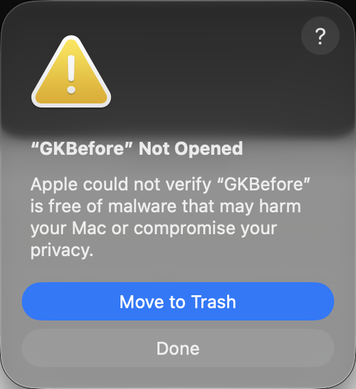
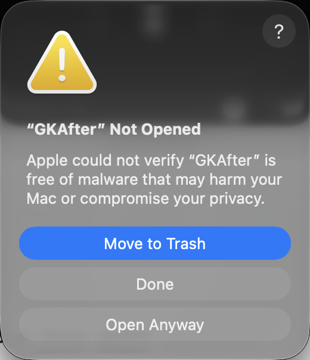
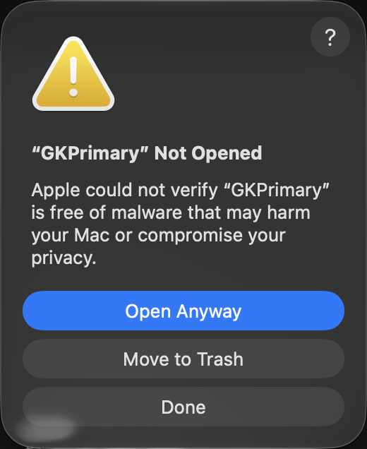
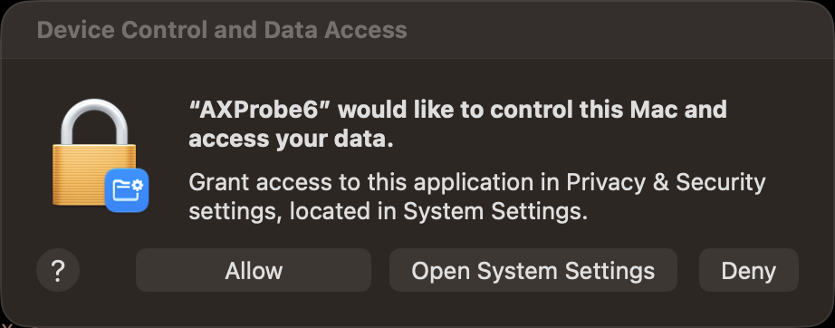
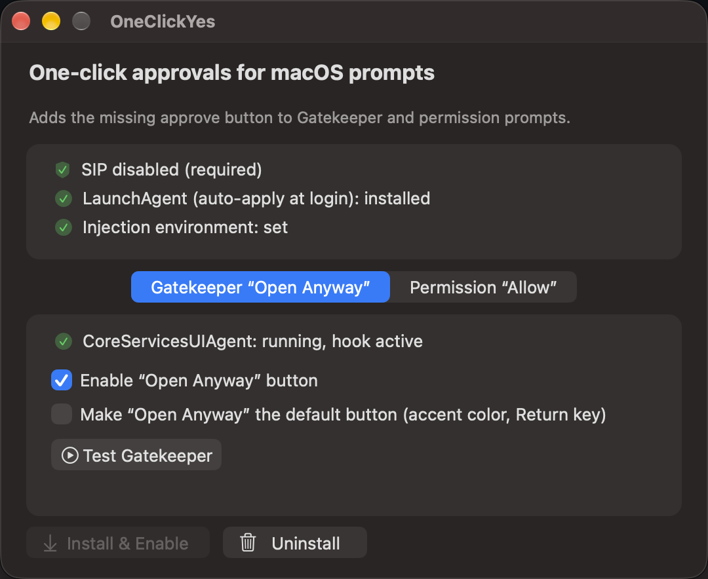

# OneClickYes


A small macOS app that adds the missing approve button to two kinds of
system dialogs that otherwise force you through System Settings:

- **Gatekeeper** "…could not verify… / Not Opened" → adds **"Open Anyway"**,
  the button Apple compiles into the OS but never displays for unverified
  software.
- **Permission warnings** ("Device Control and Data Access": Accessibility,
  Input Monitoring, Screen Recording) → adds **"Allow"**, which performs
  the same per-app TCC grant as the System Settings toggle.

Both use **Apple's own approval paths** — per-app, one explicit click.
Nothing is patched on disk, nothing global is disabled, and Gatekeeper/TCC
stay fully active. Dialogs that already have a native Allow (camera, mic,
contacts, photos, automation…) are left alone.

| Before | After | After + default-button option |
|---|---|---|
|  |  |  |

| Permission warning |
|---|
|  |

## Requirements

- macOS 27 (verified on build 26A428, Apple Silicon)
- **SIP disabled** (`csrutil disable` in Recovery)
- An admin account — Apple still asks for Touch ID/password when you
  approve Gatekeeper prompts; this tool does not bypass authentication

## Get the app

Download `OneClickYes.app.zip` from
[Releases](../../releases), unzip, and open `OneClickYes.app`.

Or build it yourself (needs Xcode command line tools):

```sh
./build-app.sh
open OneClickYes.app
```

## Using the app



1. **Install & Enable** — installs the payload and turns both features on.
   No root needed, nothing stays running.
2. **Test Gatekeeper** — opens a quarantined unsigned test app so you can
   see the button; the app shows a green confirmation once the test app
   actually launches through the new button.
3. **Test Permission** — opens a probe app that requests Accessibility so
   you can see the Allow button; the app confirms once the grant is
   functionally active.
4. **Make "Open Anyway" the default button** *(optional)* — gives the
   button accent styling and Return-key activation. Takes effect on the
   next dialog.
5. **Uninstall** — removes everything and restarts the agents clean.
   Fully reversible.

The installer app does not need to stay open — persistence across login is
handled by a one-shot LaunchAgent that exits immediately. Upgrading from
GKOpenAnyway migrates your existing install automatically.

## How it works (short version)

A tiny self-gating dylib is inserted via `DYLD_INSERT_LIBRARIES`; it
returns immediately in every process except the two that own the target
dialogs:

- `CoreServicesUIAgent` — appends a button with tag 105 to Gatekeeper
  NSAlerts that have no open path. Tag 105 is Apple's own "Open Anyway"
  dispatch tag, wired end-to-end to `LAContext` auth and per-app
  quarantine approval. (Hidden natively because "fast Gatekeeper
  override" mode is stubbed `inactive` in syspolicyd.)
- `universalAccessAuthWarn` — appends an "Allow" button to the permission
  warning window. On click it reads the real requester identity from the
  dialog's `AXAWarningInfo`, resolves the matching TCC service, and calls
  `TCCAccessSetFor{Bundle,Path}` — the same write the System Settings
  toggle performs. The requester's own Deny path is untouched.

Full reverse-engineering details: **[REPORT.md](REPORT.md)**.

## Repository layout

| Path | Purpose |
|---|---|
| `app/` | Installer app + test-app sources (AppKit, no dependencies) |
| `dylib/` | The injected payload source (self-gating swizzles) |
| `build-app.sh` | Builds dylib + `OneClickYes.app` |
| `cli/` | Optional shell install/remove scripts |
| `REPORT.md` | Full technical report |
| `images/` | Dialog screenshots |

## Safety

- Per-app approval only; no global quarantine removal, no `spctl` changes,
  no TCC database edits, no `tccutil`.
- Every approval requires an explicit click in the dialog.
- Fully reversible via the app's Uninstall button (or `cli/uninstall.sh`).
- The dylib touches nothing outside `CoreServicesUIAgent` and
  `universalAccessAuthWarn`.
- If Apple renames the private classes, the hooks simply won't install —
  nothing breaks.

## Caveats

- Requires SIP to remain disabled.
- Admin authentication is still required on Gatekeeper approve — by design.
- Input Monitoring showed a quirk where the granted flag could fail to
  persist on the first attempt; the button verifies the record and retries
  before dismissing. Screen Recording and PostEvent/RemoteDesktop share
  the same code path but are less thoroughly exercised.
- macOS updates can rename/remove the private classes; verify after updates.
